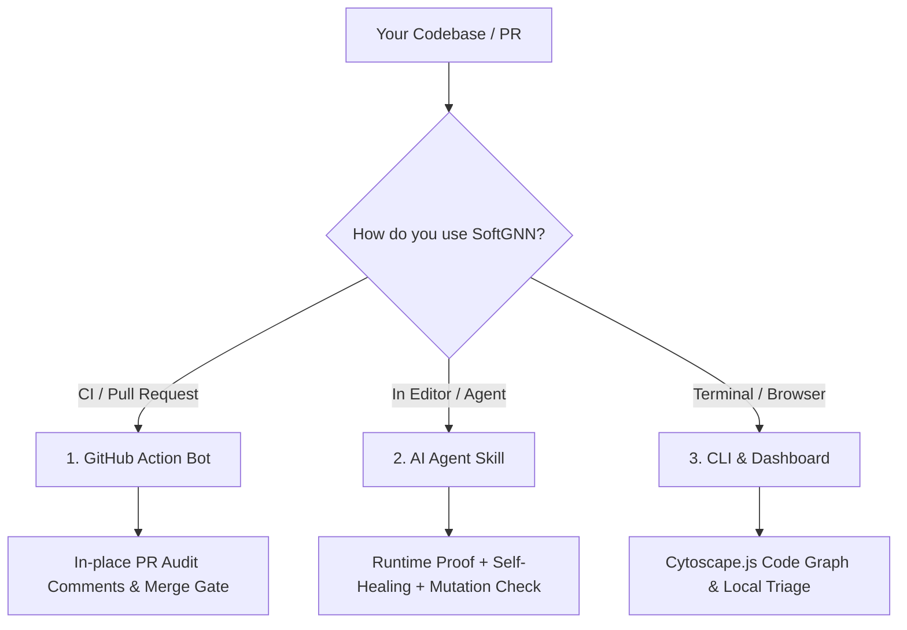

<div align="center">

# 🛡️ SoftGNN Advisor (v1.0.0 PRO)

### The Runtime-Proven & Mutation-Verified Test Advisor for AI Coding Agents & CI/CD

**Know what changed. Prove what tests hit it. Kill weak assertions.**

[](https://github.com/minhquang0407/softgnn-advisor/releases)
[](#test-suite)
[](https://www.python.org/)
[](LICENSE)
[](#1-github-action-cicd-quality-gate)
[](#2-ai-coding-agent-skill-antigravity-claude-cursor)

🎬 **[Watch Demo Video](https://www.youtube.com/watch?v=3d071eUmfq0)** · 🚀 **[Quickstart](#quickstart)** · 📖 **[Documentation](skills/softgnn-advisor/SKILL.md)**

</div>

---

## 💡 The Problem SoftGNN Solves

AI Coding Agents write tests fast, but **two massive blindspots remain**:
1. **The Fake Coverage Trap**: A test passes `pytest`, but due to early returns or over-mocking, **0% of the modified target function code is actually executed**.
2. **The Weak Assertion Trap**: A test executes the function, but only asserts `assert res is not None`. If a breaking logic bug is introduced, the test still passes.

> **SoftGNN PRO is the Ground Truth Gatekeeper.** It scans PR impact, verifies real execution at runtime, diagnoses early exits, and performs surgical micro-mutations to guarantee **Titanium-Grade tests**.

---

## ⚡ 3 Ways to Use SoftGNN



### 1. GitHub Action (CI/CD Quality Gate)
Block untested code changes directly on your GitHub Pull Requests.
Add `.github/workflows/softgnn-audit.yml` to **any repo**:

```yaml
name: SoftGNN PR Audit
on: [pull_request]

jobs:
  audit:
    runs-on: ubuntu-latest
    permissions:
      contents: read
      pull-requests: write
    steps:
      - uses: actions/checkout@v4
        with:
          fetch-depth: 0
      - uses: minhquang0407/softgnn-advisor@v1.0.0
        with:
          github-token: ${{ secrets.GITHUB_TOKEN }}
          fail-on-missing: "false" # Set true to block merge if runtime test proof is missing
```

### 2. AI Coding Agent Skill (Antigravity, Claude, Cursor)
Turn SoftGNN into a local Agent Skill with **Zero API Keys required** (the Coding Agent is the author, SoftGNN is the runtime gate):

```bash
# Install for Antigravity:
python skills/softgnn-advisor/scripts/install_skill.py --target antigravity

# Or install via Open Skills standard (Claude Code / Codex):
npx skills add minhquang0407/softgnn-advisor
```

Ask your agent:
> *"Use softgnn-advisor to scan my changes and write runtime-proven tests with mutation checks."*

### 3. Local CLI & Interactive Web Dashboard
Visualize your code graph and manage test impact from a visual Cytoscape UI:

```bash
pip install softgnn-advisor

# Open local visual knowledge graph
softgnn dashboard --project my-project --open
```

---

## 🛡️ What Makes SoftGNN PRO Unique?

| Feature | Standard AI / CI | SoftGNN PRO | Why It Matters |
| :--- | :---: | :---: | :--- |
| **Runtime Proof Gate** | ❌ None | 🛡️ **Enforced** | Verifies tests hit exact bytecode/AST line ranges, not just smoke tests. |
| **Self-Healing Diagnoser** | ❌ Raw trace | 🩺 **AST Deep Scan** | Identifies early-exit `if` guards & mock mismatches to guide the Agent. |
| **Micro-Mutation Gate** | ❌ Slow / Heavy | 🔬 **Targeted AST** | Inverts operators (`>`, `==`, `+`, `True`) inside the target function to kill weak asserts (**TITANIUM PROOF**). |
| **Swarm Concurrency** | ❌ Conflicts | 🐝 **Process-Isolated** | Isolated temp coverage sessions allow sub-agents to test concurrently with zero race conditions. |
| **Polyglot Track** | ❌ Python only | 🌐 **Universal LCOV** | Dual-track support for Python, TypeScript, JavaScript, Go, Rust, Java, and C++. |

---

## 🚀 Quickstart

### Daily Commands

```bash
# 1. Scan changed functions needing tests
softgnn agent scan

# 2. Get exact context (AST lines, callers, imports) for a function
softgnn agent context --target "FUNC:my_module.my_func"

# 3. Verify that a test actually exercises the target function
softgnn agent verify --target "FUNC:my_module.my_func" --test "tests/test_my_func.py"

# 4. PRO: Verify with Micro-Mutation Gate (detect weak assertions)
python skills/softgnn-advisor/scripts/verify_runtime_proof.py \
  --target "FUNC:calculate_total" \
  --test "tests/test_pricing.py" \
  --mutation-check
```

### Self-Healing Feedback Example
When a test fails runtime proof, SoftGNN provides immediate actionable hints:

```json
{
  "proof_status": "fail",
  "covered_fraction": 0.0,
  "self_healing": {
    "diagnosis": "EARLY_BRANCH",
    "failing_branch_line": 42,
    "condition_code": "if user is None:",
    "actionable_suggestion": "Function exited early at line 42 ('if user is None:'). Adjust mock/input data so condition evaluates to proceed into body."
  }
}
```

### Micro-Mutation Feedback Example (Proof Grade)

```json
{
  "proof_status": "pass",
  "proof_grade": "TITANIUM",
  "mutation_proof": {
    "mutation_gate_status": "passed",
    "mutants_total": 3,
    "mutants_killed": 3,
    "mutants_survived": 0,
    "message": "🛡️ TITANIUM PROOF: All mutants killed. Behavioral assertions verified."
  }
}
```

---

## 🐝 Sub-Agent Swarms (`skill-to-workflow`)

SoftGNN supports fan-out concurrency for multi-agent workflows (such as [`democra-ai/skill-to-workflow`](https://github.com/democra-ai/skill-to-workflow) or native Antigravity `invoke_subagent`):

```bash
softgnn agent scan --fan-out
```

Emits decoupled task payloads so a parent orchestrator can dispatch $N$ independent sub-agents simultaneously without `.coverage` locking conflicts.

---

## 🧪 Test Suite

SoftGNN Advisor is verified across a comprehensive test suite covering AST parsing, runtime mapping, self-healing diagnostics, mutation gates, and GitHub Action workflows:

```bash
pytest
# ======================= 66 passed in 31.79s =======================
```

---

## 📄 License

Distributed under the [MIT License](LICENSE).
