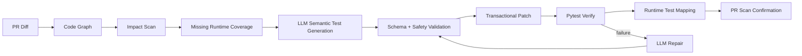

<div align="center">

# SoftGNN Advisor

### Graph-guided, runtime-proven, LLM-assisted PR testing

**Know what changed. Know what tests hit it. Generate what is missing. Visualize your codebase.**

[](https://github.com/minhquang0407/softgnn-advisor/actions/workflows/tests.yml)
[](https://github.com/minhquang0407/softgnn-advisor/releases)
[](https://pypi.org/project/softgnn-advisor/)
[](LICENSE)
[](https://www.python.org/)
[](#configure-an-llm-provider)

🎬 **[Watch the demo video](docs/assets/softgnn-demo.mp4)**

</div>

---

## Install

Recommended for CLI use:

```bash
pipx install softgnn-advisor
```

Or install into your current environment:

```bash
pip install softgnn-advisor
```

Optional extras:

```bash
pip install "softgnn-advisor[llm]"   # Gemini / OpenAI-compatible generation
pip install "softgnn-advisor[gnn]"   # PyTorch Geometric ranking
pip install "softgnn-advisor[all]"   # full stack
```

Then run:

```bash
softgnn setup /path/to/your-repo --project my-app
softgnn generate --project my-app
```

---

## What is SoftGNN?

SoftGNN Advisor is an experimental CLI that combines a **code graph**, **runtime test graph**, and **LLM test generation** to help you understand PR impact and generate missing pytest tests.

Most AI testing tools stop at:

```text
read changed file -> ask LLM for tests -> run pytest
```

SoftGNN aims for a stronger loop:

```text
scan PR -> find impacted code -> map tests that actually execute it -> generate missing tests -> verify -> refresh runtime proof
```

> **Core thesis:** a generated test is not truly useful until it passes pytest and proves it hits the intended code.

---

## The pipeline



---

## Why it is different

| Capability | Naive LLM test generation | SoftGNN Advisor |
|---|---:|---:|
| Reads changed code | ✅ | ✅ |
| Generates pytest tests | ✅ | ✅ |
| Validates structured LLM output | ❌ | ✅ |
| Patches transactionally | ❌ | ✅ |
| Rolls back failed generated tests | ❌ | ✅ |
| Maps tests to functions at runtime | ❌ | ✅ |
| Confirms PR coverage after generation | ❌ | ✅ |
| Smart scan fallback (empty diff) | ❌ | ✅ |
| Interactive graph dashboard | ❌ | ✅ |
| File-scoped test generation | ❌ | ✅ |
| Supports Gemini/OpenAI-compatible LLMs | varies | ✅ |

---

## Features

- **PR impact scanning** between Git revisions.
- **Code graph extraction** from Python source files.
- **Runtime test mapping** from pytest execution to source functions.
- **Missing runtime coverage detection** for impacted functions.
- **LLM-assisted semantic pytest generation**.
- **Native Gemini provider** and **OpenAI-compatible provider**.
- **Structured JSON validation** before writing tests.
- **Safety validation** against unsafe generated code patterns.
- **Transactional patching** with generated block markers.
- **Pytest verification** and bounded generated-test repair loop.
- **Runtime refresh** after successful generation.
- **PR scan confirmation** after runtime refresh.
- **Smart scan fallback** — auto-detects empty diffs and falls back to recent pull, filesystem, or full-scan.
- **Interactive local graph dashboard** — visualize your codebase graph and run commands from a browser UI.
- **File-scoped generation** — generate tests only for a specific source file.
- **Graph refresh** — rebuild graph and snapshot after `git pull`.

---

## Quickstart

```bash
softgnn setup /path/to/your-repo --project my-app
softgnn generate --project my-app
```

Or stage by stage:

```bash
softgnn scan --project my-app
softgnn plan --project my-app
softgnn apply --project my-app
```

Stage meaning:

```text
scan  = inspect repo changes and save a reusable scan snapshot
plan  = create a test plan from the saved scan, auto-scanning if none exists
apply = write generated test blocks, run pytest, repair, rollback, and refresh runtime map
```

`generate` is the convenience shortcut for `scan -> plan -> apply`.

---

## Smart scan fallback

SoftGNN automatically handles common zero-diff situations. After `git pull` the local branch and HEAD are the same commit, so the default `main...HEAD` diff is empty. The smart fallback tries:

```text
1. recent reflog range (HEAD@{1}...HEAD)
2. filesystem snapshot diff
3. optional full-scan (--fallback-full-scan)
```

This works transparently for `scan` and `pr-scan`:

```bash
softgnn scan --project my-app
softgnn pr-scan --project my-app
```

For `generate` (which writes files), SoftGNN uses a **safe interactive fallback** instead:

- If the worktree is dirty → warns you to commit first or use `--source filesystem`.
- If committed directly on main with empty diff → asks before using `HEAD~1...HEAD`.

```bash
softgnn generate --project my-app --yes   # accept the safe prompt automatically
```

---

## Refresh after git pull

After pulling shared changes, rebuild the SoftGNN graph and filesystem snapshot:

```bash
softgnn refresh --project my-app
```

Options:

```bash
softgnn refresh --project my-app --runtime   # also refresh pytest runtime coverage
softgnn refresh --project my-app --train     # also retrain GNN weights
```

---

## Interactive graph dashboard

Start the local dashboard (bound to localhost for safety):

```bash
softgnn dashboard --project my-app --open
```

Opens at `http://127.0.0.1:8765`.

The dashboard lets you:

- Visualize the knowledge graph with Cytoscape.js
- Search and filter nodes by type or name
- Focus the graph on a source file or specific node
- See selected node details and coverage status
- Run actions from the browser:

| Button | Action |
|---|---|
| Refresh Graph View | Reload graph data |
| Run Scan | `softgnn scan` |
| Run PR Scan | `softgnn pr-scan` |
| Run Impact for Selected | `softgnn impact` for the selected node |
| Refresh SoftGNN Memory | `softgnn refresh` |
| Map Runtime Coverage | `softgnn map` |
| Generate Selected File | `softgnn generate --only-file <selected>` |
| Generate Selected Node | `softgnn generate --target <selected>` |

Write actions show a confirmation modal. After generate or map completes, the graph reloads automatically — new test nodes and runtime edges will appear.

Options:

```bash
softgnn dashboard --project my-app --port 8777 --open
```

---

## File-scoped generation

Generate tests only for targets in a specific source file:

```bash
softgnn generate --project my-app --only-file src/foo.py
softgnn generate --project my-app --only-file src/foo.py --source filesystem
softgnn plan --project my-app --only-file src/foo.py
```

If no matching targets are found in that file for the current scan, SoftGNN prints a clear hint.

---

## Configure an LLM provider

### Gemini

```bash
export SOFTGNN_LLM_PROVIDER=gemini
export SOFTGNN_LLM_MODEL=gemini-2.5-flash
export SOFTGNN_LLM_API_KEY=YOUR_GEMINI_API_KEY
```

PowerShell:

```powershell
$env:SOFTGNN_LLM_PROVIDER="gemini"
$env:SOFTGNN_LLM_MODEL="gemini-2.5-flash"
$env:SOFTGNN_LLM_API_KEY="YOUR_GEMINI_API_KEY"
```

### OpenAI-compatible endpoint

```bash
export SOFTGNN_LLM_PROVIDER=openai-compatible
export SOFTGNN_LLM_BASE_URL=http://localhost:11434/v1
export SOFTGNN_LLM_MODEL=qwen2.5-coder:7b
```

Generation strategies:

```text
template  -> deterministic templates only, no LLM required
llm       -> require configured LLM
auto      -> try LLM first, fallback to templates when unavailable
```

---

## Daily commands

| Goal | Command |
|---|---|
| Build graph and snapshot | `softgnn setup /repo --project my-app` |
| Rebuild graph after git pull | `softgnn refresh --project my-app` |
| Open interactive dashboard | `softgnn dashboard --project my-app --open` |
| One-shot plan + apply + verify | `softgnn generate --project my-app` |
| Generate for specific file | `softgnn generate --project my-app --only-file src/foo.py` |
| Generate for specific function | `softgnn generate --project my-app --target FUNC:foo` |
| Accept safe same-branch fallback | `softgnn generate --project my-app --yes` |
| Review before patching | `softgnn plan --project my-app` |
| Apply reviewed plan | `softgnn apply --project my-app` |
| Inspect change impact | `softgnn scan --project my-app` |
| Scan PR with report | `softgnn pr-scan --project my-app --report --open-report` |
| Runtime test map | `softgnn map --project my-app` |
| Impact of one symbol | `softgnn impact --project my-app FUNC:foo` |
| Health check | `softgnn doctor --project my-app` |
| Developer triage | `softgnn triage --project my-app "bug description"` |

---

## Safety model

SoftGNN is conservative by default:

```text
writes tests/ only
wraps generated code in markers
validates LLM output before patching
runs pytest before accepting generated tests
rolls back failed generated edits by default
dashboard server binds to localhost only
dashboard actions are allowlisted — no arbitrary shell execution
never requires committing API keys
```

Generated test blocks are marked:

```python
# <softgnn-generated target="FUNC:example" start>
...
# <softgnn-generated target="FUNC:example" end>
```

Recommended workflow:

```text
run on a feature branch
use plan first to review proposed tests
use generate after review
inspect git diff before commit
```

---

## Verified demo

On a local `social-link-prediction` repo, SoftGNN used Gemini to generate behavior tests for:

```text
FUNC:is_edge_index_sorted
```

Result:

```text
pytest: 6 passed
runtime mode: per-test
runtime edges: 336
persisted: True
missing coverage before: 0
missing coverage after: 0
```

Fallback without an LLM produced only a shallow smoke test:

```python
assert callable(is_edge_index_sorted)
```

Gemini-assisted generation produced behavior checks for sorted edges, unsorted source order, unsorted target order, single-edge input, and invalid-shape errors.

Read the full demo: [docs/examples/social-link-demo.md](docs/examples/social-link-demo.md)

---

## Development install

```bash
git clone https://github.com/minhquang0407/softgnn-advisor.git
cd softgnn-advisor
python -m venv .venv
source .venv/bin/activate   # Linux/macOS
.venv\Scripts\activate      # Windows
pip install -e ".[all]"
softgnn --help
```

> PyTorch / PyTorch Geometric installs can be platform-specific. Follow the official PyTorch and PyG installation guides for your environment.

---

## Project status

Current release: **v0.1.25**

This is a developer preview. Generated tests should be reviewed before commit. Production-code fixes are intentionally out of scope for v0.1.

---

## Roadmap

```text
M4  Runtime-Proven Test Generation         ✅ complete
M5  Smart Scan + Dashboard + File Generate ✅ complete
M6  Learned Test Prioritization / GNN Ranking
M7  Multi-Agent Quality Swarm
M8  Large-scale repo automation
M9  Controlled production-code fixes
```

Read more:

- [ROADMAP.md](ROADMAP.md)
- [docs/future-milestones.md](docs/future-milestones.md)

---

## License

MIT License. See [LICENSE](LICENSE).
