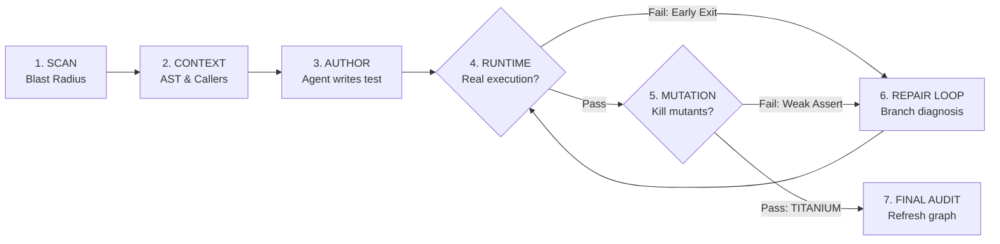
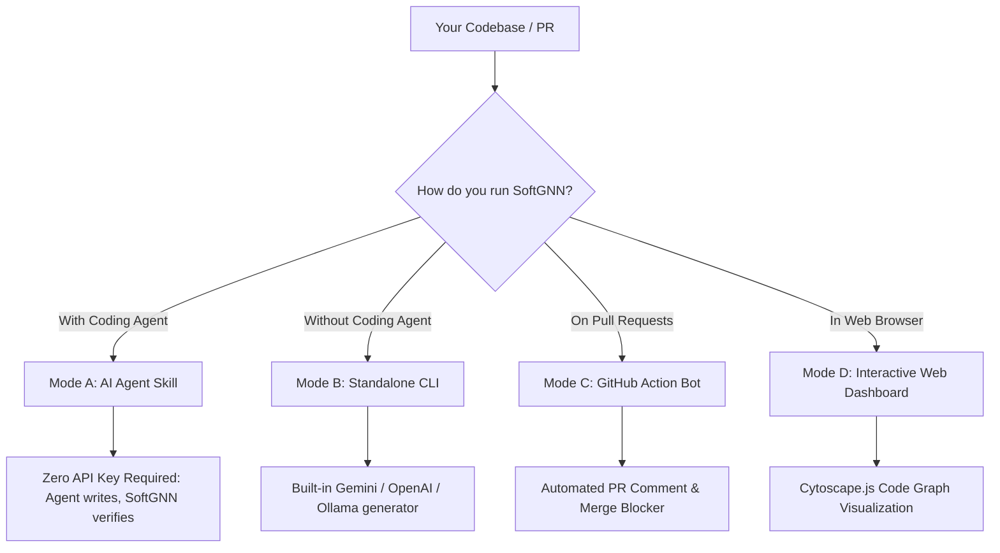

<div align="center">

# 🛡️ SoftGNN Advisor (v1.0.0 PRO)

### The Runtime-Proven & Mutation-Verified Test Advisor for AI Coding Agents & CI/CD

**Know what changed. Prove what tests hit it. Kill weak assertions.**

[](https://github.com/minhquang0407/softgnn-advisor/releases)
[](#test-suite)
[](https://www.python.org/)
[](LICENSE)
[](#mode-c-github-action-cicd-quality-gate)
[](#mode-a-ai-coding-agent-skill-zero-api-key)

🎬 **[Watch Demo Video](https://www.youtube.com/watch?v=3d071eUmfq0)** · 🚀 **[Quickstart](#-quickstart)** · 📖 **[CLI Manual](docs/cli-reference.md)**

<br/>


</div>

---

## 💡 Core Philosophy: "LLM = Author, SoftGNN = Ground Truth"

AI test generators write code fast, but **two massive blindspots remain**:
1. **The Fake Coverage Trap**: A test passes `pytest`, but due to early returns or over-mocking, **0% of the modified target function code is actually executed**.
2. **The Weak Assertion Trap**: A test executes the function, but only asserts `assert res is not None`. If a breaking logic bug is introduced, the test still passes.



> **SoftGNN PRO is your infallible Ground Truth Gatekeeper.** It proves real execution, diagnoses early exits, and performs surgical micro-mutations to guarantee **Titanium-Grade tests**.

---

## ⚡ Execution Modes: Choose Your Setup

SoftGNN operates in **two primary ways** depending on whether you are using an AI Coding Agent or running standalone in your terminal:



---

### Mode A: AI Coding Agent Skill (Zero API Key)
**Recommended for Antigravity, Claude Code, Cursor, and Codex.**

In Agent Mode, the Coding Agent acts as the author while SoftGNN provides the AST ground truth, runtime proof gate, and mutation testing. **Zero third-party API keys are required for SoftGNN**:

```bash
# 1. Install skill for Antigravity:
python skills/softgnn-advisor/scripts/install_skill.py --target antigravity

# Or install via Open Skills standard (Claude Code / Codex):
npx skills add minhquang0407/softgnn-advisor
```

Ask your agent:
> *"Use softgnn-advisor to scan my changes and write runtime-proven tests with mutation checks."*

---

### Mode B: Standalone Developer CLI (Built-in LLM Generator)
**Run directly from your terminal without any external AI coding agent.**

SoftGNN connects to your configured LLM (Gemini, OpenAI, or local Ollama), generates structured pytest tests, patches them transactionally, runs pytest, auto-repairs failures, and rolls back cleanly if tests cannot pass.

#### 1. Configure LLM API Keys (For Standalone Mode)

**Google Gemini (Recommended):**
```bash
# Linux / macOS:
export SOFTGNN_LLM_PROVIDER="gemini"
export SOFTGNN_LLM_MODEL="gemini-2.5-flash"
export SOFTGNN_LLM_API_KEY="AIzaSyYourGeminiApiKeyHere..."

# Windows PowerShell:
$env:SOFTGNN_LLM_PROVIDER="gemini"
$env:SOFTGNN_LLM_MODEL="gemini-2.5-flash"
$env:SOFTGNN_LLM_API_KEY="AIzaSyYourGeminiApiKeyHere..."
```

**OpenAI / Local Ollama / vLLM / DeepSeek:**
```bash
# Linux / macOS:
export SOFTGNN_LLM_PROVIDER="openai-compatible"
export SOFTGNN_LLM_BASE_URL="http://localhost:11434/v1"   # For Ollama
export SOFTGNN_LLM_MODEL="qwen2.5-coder:7b"               # Or gpt-4o
export SOFTGNN_LLM_API_KEY="optional-or-sk-..."

# Windows PowerShell:
$env:SOFTGNN_LLM_PROVIDER="openai-compatible"
$env:SOFTGNN_LLM_BASE_URL="http://localhost:11434/v1"
$env:SOFTGNN_LLM_MODEL="qwen2.5-coder:7b"
$env:SOFTGNN_LLM_API_KEY="optional-or-sk-..."
```

*(Note: If no API key is provided, SoftGNN automatically falls back to offline deterministic AST templates).*

#### 2. Standalone Workflow Commands

```bash
# Step 1: Onboard repository (build graph & snapshot)
softgnn setup . --project my-app

# Step 2: One-shot scan -> plan -> generate -> verify
softgnn generate --project my-app

# Or review proposed test code before patching:
softgnn plan --project my-app
softgnn apply --project my-app
```

---

### Mode C: GitHub Action (CI/CD Quality Gate)
Block untested code changes directly on your GitHub Pull Requests.
Add `.github/workflows/softgnn-audit.yml` to **any repo**:

```yaml
name: SoftGNN PR Quality Gate
on: [pull_request]

jobs:
  audit:
    runs-on: ubuntu-latest
    permissions:
      contents: read
      pull-requests: write
    steps:
      - uses: actions/checkout@v4
        with:
          fetch-depth: 0
      - uses: minhquang0407/softgnn-advisor@v1.0.0
        with:
          github-token: ${{ secrets.GITHUB_TOKEN }}
          fail-on-missing: "false" # Set 'true' to block merge if tests are missing
```

---

### Mode D: Interactive Web Dashboard
Visualize your entire codebase knowledge graph and manage test impact from an interactive web UI:

```bash
softgnn dashboard --project my-app --open
```

Opens at `http://127.0.0.1:8765`:
- **Interactive Cytoscape Graph**: Visually navigate functions, classes, and runtime test-to-code edges.
- **Node Filtering & Search**: Filter by symbol type (`FUNC`, `CLASS`, `FILE`, `TEST`) or search by name.
- **One-Click Actions**: Run Scans, trigger Runtime Mapping, and generate tests directly from the browser UI.

---

## 🛡️ What Makes SoftGNN PRO Unique?

| Feature | Standard AI / CI | SoftGNN PRO | Why It Matters |
| :--- | :---: | :---: | :--- |
| **Runtime Proof Gate** | ❌ None | 🛡️ **Enforced** | Verifies tests hit exact bytecode/AST line ranges, not just smoke tests. |
| **Self-Healing Diagnoser** | ❌ Raw trace | 🩺 **AST Deep Scan** | Identifies early-exit `if` guards & mock mismatches to guide the Agent. |
| **Micro-Mutation Gate** | ❌ Slow / Heavy | 🔬 **Targeted AST** | Inverts operators (`>`, `==`, `+`, `True`) inside the target function to kill weak asserts (**TITANIUM PROOF**). |
| **Latent Blast Radius** | ❌ Direct only | 🌐 **HGT Graph AI** | Predicts remote components at risk of breaking via graph embeddings and co-change history. |
| **Bug & Reviewer Triage**| ❌ Manual | 👥 **Semantic Matching**| Suggests the best-suited code owner to review PRs or fix bugs based on Git authorship and GNN embeddings. |
| **Swarm Concurrency** | ❌ Conflicts | 🐝 **Process-Isolated** | Isolated temp coverage sessions allow sub-agents to test concurrently with zero race conditions. |
| **Polyglot Track** | ❌ Python only | 🌐 **Universal LCOV** | Dual-track support for Python, TypeScript, JavaScript, Go, Rust, Java, and C++. |

---

## 🚀 Quickstart

### Daily Commands (Agent Mode)

```bash
# 1. Scan changed functions needing tests
softgnn agent scan

# 2. Query latent blast radius & downstream dependencies
softgnn agent impact --target "FUNC:checkout" --mode hybrid

# 3. Recommend expert reviewers or triage a bug
softgnn agent triage "Database connection pool timeout"

# 4. PRO: Verify test execution with Micro-Mutation Gate
python skills/softgnn-advisor/scripts/verify_runtime_proof.py \
  --target "FUNC:calculate_total" \
  --test "tests/test_pricing.py" \
  --mutation-check
```

### Self-Healing Feedback Example
When a test fails runtime proof, SoftGNN provides immediate actionable hints:

```json
{
  "proof_status": "fail",
  "covered_fraction": 0.0,
  "self_healing": {
    "diagnosis": "EARLY_BRANCH",
    "failing_branch_line": 42,
    "condition_code": "if user is None:",
    "actionable_suggestion": "Function exited early at line 42 ('if user is None:'). Adjust mock/input data so condition evaluates to proceed into body."
  }
}
```

### Micro-Mutation Feedback Example (Proof Grade)

```json
{
  "proof_status": "pass",
  "proof_grade": "TITANIUM",
  "mutation_proof": {
    "mutation_gate_status": "passed",
    "mutants_total": 3,
    "mutants_killed": 3,
    "mutants_survived": 0,
    "message": "🛡️ TITANIUM PROOF: All mutants killed. Behavioral assertions verified."
  }
}
```

---

## 💻 CLI Quick Reference

| Command | Action |
| :--- | :--- |
| `softgnn agent scan` | Detect altered functions lacking runtime test proof |
| `softgnn agent context --target <id>` | Query AST line ranges, callers, and import dependencies |
| `softgnn agent verify-proof --target <id> --test <p>` | Verify runtime execution proof |
| `softgnn agent verify-proof ... --mutation-check` | **PRO**: Invert AST operators to kill weak assertions (**Titanium Proof**) |
| `softgnn agent impact --target <id>` | **Tier 2**: Query direct dependents & latent HGT blast radius |
| `softgnn agent triage "bug description"` | **Tier 2**: Recommend expert code reviewers for a bug or PR |
| `softgnn agent train` | **Tier 2**: Trigger offline HGT Graph AI training |
| `softgnn dashboard --project <app> --open` | Launch interactive Cytoscape.js web knowledge graph |
| `softgnn setup <repo> --project <app>` | Build initial code graph & filesystem baseline snapshot |
| `softgnn generate --project <app>` | Standalone one-shot test generation with automatic rollback |
| `softgnn pr-scan --project <app> --report` | Scan PR diff, compute blast radius & export HTML report |
| `softgnn doctor --project <app>` | Validate dependencies, metadata, and graph integrity |

📖 *For the complete reference of all 21 commands, options, and advanced pipelines, see [docs/cli-reference.md](docs/cli-reference.md).*

---

## 🧪 Test Suite

SoftGNN Advisor is verified across a comprehensive test suite covering AST parsing, runtime mapping, self-healing diagnostics, mutation gates, HGT triage, and GitHub Action workflows:

```bash
pytest
# ======================= 75 passed in 39.68s =======================
```

---

## 📄 License

Distributed under the [MIT License](LICENSE).
