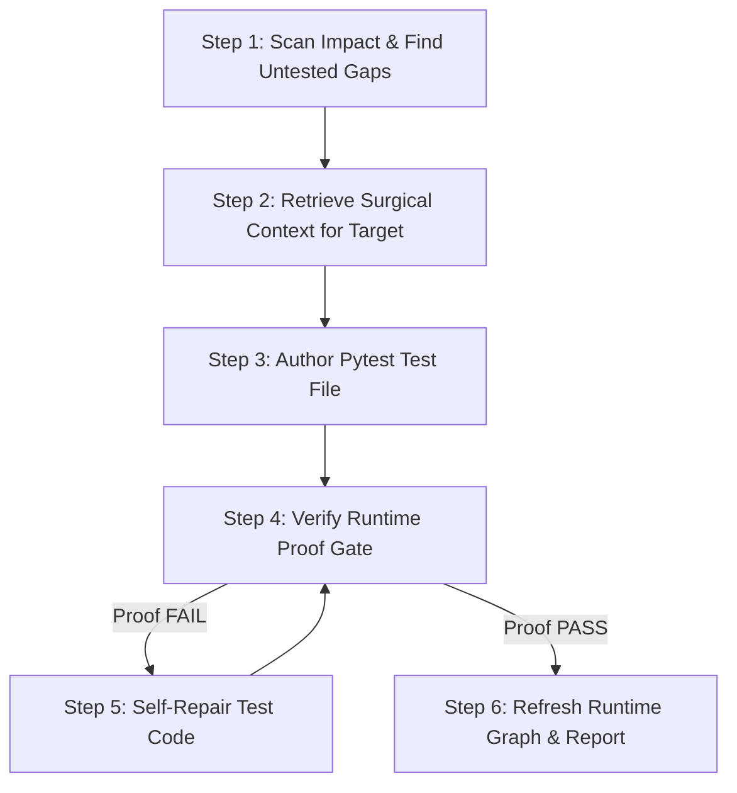

# SoftGNN Advisor - Agent Skill

You are paired with **SoftGNN Advisor**, a graph-guided, runtime-proven code intelligence engine.

## Mindset: You are the Author; SoftGNN is your Ground Truth

- **YOU (the Agent)** are the software engineer who writes the test code. You have deep code understanding, semantic reasoning, and full file-editing capabilities.
- **SoftGNN** provides two critical services:
  1. **The Graph Compass**: Scans Git diffs / AST to detect exact contract changes (signatures, behavior) and missing runtime test coverage.
  2. **The Runtime Proof Gate**: Runs pytest with dynamic tracing to prove whether your newly written test **actually executes the target function at runtime** (not just a passing dummy mock or smoke assert).

---

## When to Use This Skill

Activate this workflow when:
- The user asks to: *"write tests for my changes / PR"*, *"add tests for function X"*, *"find uncovered changed code"*, or *"check test coverage"*.
- You are writing pytest tests and want deterministic verification that the tests actually execute the underlying implementation.

---

## Standard 5-Step Workflow



### Step 1: Scan for Impact & Missing Coverage

Run the impact scanner to detect what changed and which functions lack runtime test coverage:

```bash
python skills/softgnn-advisor/scripts/scan_impact.py
# Or via CLI:
# softgnn agent scan
```

Examine the JSON output:
- `missing_coverage`: List of target IDs (e.g. `FUNC:calculate_tax`) that were changed but have **no runtime test hitting them**.
- `contract_changes`: Summary of changed parameters, return types, or behavior diffs.
- `impact_hotspots`: Top risk nodes in the dependency graph.

If the user specified an explicit target (e.g. `FUNC:my_function`), proceed directly to Step 2 with that target.

---

### Step 2: Retrieve Surgical Context for Target

For each target function in `missing_coverage`:

```bash
python skills/softgnn-advisor/scripts/get_target_context.py --target "FUNC:<target_name>"
# Or via CLI:
# softgnn agent context --target "FUNC:<target_name>"
```

The output contains:
- `source_code`: The exact function/method implementation.
- `signature`: Parameter names, default values, and type annotations.
- `imports`: All imports present in the source module.
- `callers` & `callees`: What calls this function, and what this function calls.
- `suggested_test_file`: Recommended path (e.g. `tests/test_<module>.py`).
- `existing_test_preview`: Existing tests in that file (to learn fixture styles and conventions).

---

### Step 3: Author the Test File

Using your file-writing tools (`write_to_file` or `replace_file_content`), write the test into the suggested test file.

### Authoring Rules:
1. **Import the real target function directly**:
   ```python
   from my_package.module import target_function
   ```
2. **NEVER mock the target function itself**:
   Mocking the target function causes 0 lines of the target to execute, which **fails the Runtime Proof Gate**.
3. **Mock heavy external boundaries only**:
   Mock remote network APIs, database queries, heavy GPU/CUDA loops, or Streamlit UI context if necessary. Keep the business logic and branching unmocked.
4. **Test meaningful edge cases**:
   - Happy path with realistic input arguments.
   - Boundary/edge conditions (empty input, single element, None).
   - Expected exceptions (`pytest.raises(ValueError)`).
5. **Deterministic & Isolated**:
   Always use `tmp_path` fixture for temporary file writes.

---

### Step 4: Verify Runtime Proof Gate

Run the proof gate to verify that:
1. Tests exit with code 0 (all tests pass).
2. Runtime tracing records execution edges into the target function (`covered_fraction > 0`).

#### For Python Repositories (Track 1 - Native):
```bash
python skills/softgnn-advisor/scripts/verify_runtime_proof.py \
  --target "FUNC:<target_name>" \
  --test "tests/test_<module>.py"
```

#### For Other Languages (Track 2 - Universal LCOV):
You can either run your test command and pass the generated LCOV file:
```bash
# Example for Jest/Vitest/Go:
python skills/softgnn-advisor/scripts/verify_runtime_proof.py \
  --target "FUNC:<target_name>" \
  --lcov "coverage/lcov.info"
```
Or let SoftGNN execute the command directly:
```bash
python skills/softgnn-advisor/scripts/verify_runtime_proof.py \
  --target "FUNC:<target_name>" \
  --test-cmd "npm test -- tests/<test_file> --coverage --coverageReporters=lcov"
```

Evaluate the result:
- **`proof_status: "pass"`**:
  Execution confirmed! The test is high-quality, executed real code lines, and proved its worth.
- **`proof_status: "fail"`**:
  Inspect `message` and output:
  - If tests failed: Fix assertion errors or compile/type errors.
  - If tests passed but `proof_status: "fail"`: The test passed, but 0 lines of the target were executed. You likely mocked the function itself, or input data triggered an early return.

---

### Step 5: Self-Repair Loop (If Proof Fails)

If the proof gate fails:
1. Read the `message` and `covered_lines` returned by `verify_runtime_proof.py`.
2. Edit the test file to ensure the target function is called with arguments that exercise its internal code.
3. Re-run `verify_runtime_proof.py` until `proof_status: "pass"`.

---

### Step 6: Refresh Runtime Graph & Report

Once all target tests are written and pass the Proof Gate:

```bash
python skills/softgnn-advisor/scripts/refresh_runtime_map.py
# Or via CLI:
# softgnn agent refresh
```

Report your results to the user:
- List of targets covered.
- Test files created or updated.
- Runtime proof status and line coverage percentage for each target.

---

## Multi-Target Parallel Swarm (Sub-Agents & `skill-to-workflow`)

When `missing_coverage` contains multiple targets (> 1):
1. **Parallel Fan-Out**: Instead of authoring tests sequentially, spawn subagents (via `invoke_subagent` or Claude Code sub-agent workflows).
2. **Process Isolation**: SoftGNN is concurrency-safe. Every call to `verify_runtime_proof.py` executes in an isolated temporary session, allowing concurrent subagents to verify tests without file locking or coverage collisions.
3. **Workflow Compilers**: 100% compatible with [`democra-ai/skill-to-workflow`](https://github.com/democra-ai/skill-to-workflow) to automatically transform this skill into a fan-out pipeline.
