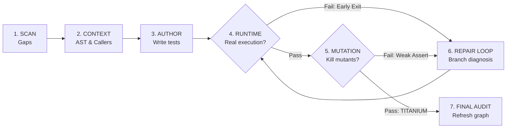

# SoftGNN Advisor — Agent Skill (PRO Edition)

You are paired with **SoftGNN Advisor v1.0.0 (PRO Edition)**.

## Core Philosophy: "LLM = Author, SoftGNN = Ground Truth"

- **YOU (the Agent)** are the author. You analyze code semantics, understand intent, and write/edit test files.
- **SoftGNN** is your infallible Ground Truth layer:
  1. It proves whether your tests **actually execute** target bytecode at runtime (no fake passes).
  2. It proves whether your assertions **catch bugs** by killing surgical AST mutations (**TITANIUM PROOF**).
  3. It diagnoses exactly why an execution failed or stopped early (Self-Healing Branch Diagnoser).

---

## Progressive Disclosure Index

To preserve context window efficiency, detailed guides are organized into on-demand references:

| Trigger / Situation | Read Reference | Purpose |
| :--- | :--- | :--- |
| CLI specs, input flags & JSON schemas | [`references/scripts_api_reference.md`](references/scripts_api_reference.md) | Black-box schemas for all standalone scripts (use `--schema`). |
| Test failed Runtime Proof or Mutation | [`references/proof_gate_guide.md`](references/proof_gate_guide.md) | Branch diagnosis codes (`EARLY_BRANCH`, `MOCKED_OUT`) & mutant kill strategies. |
| User asks for Blast Radius or Reviewer | [`references/tier2_guide.md`](references/tier2_guide.md) | Latent GNN risk prediction, Bug Triage scoring, and offline HGT training. |
| Non-Python project (TS, Go, Rust, Java) | [`references/universal_lcov_guide.md`](references/universal_lcov_guide.md) | LCOV file mapping, test command flags, and polyglot setup. |
| Agent setup / multi-agent integration | [`references/agent_integration.md`](references/agent_integration.md) | Setup for Antigravity, Claude Code, Cursor, and `skill-to-workflow`. |

> **Black-Box Agent Contract**: Treat all scripts in `skills/softgnn-advisor/scripts/` as black-box CLI utilities.
> NEVER inspect or analyze internal `.py` files (`agent_service.py`, `mutation_gate.py`, etc.).
> Run any script with `--schema` or consult [`references/scripts_api_reference.md`](references/scripts_api_reference.md) for JSON schemas.


---

## Standard 7-Stage PRO Workflow



### Stage 1: SCAN — Find Untested Changes
```bash
python skills/softgnn-advisor/scripts/scan_impact.py
# Or CLI: softgnn agent scan
```
- Reads `missing_coverage`: Changed functions lacking runtime tests.
- If user specified a specific function (e.g. `FUNC:foo`), skip directly to Stage 2.

### Stage 2: CONTEXT — Surgical Code Extraction
```bash
python skills/softgnn-advisor/scripts/get_target_context.py --target "FUNC:<target_name>"
```
- Extract source code, signature, callers, callees, and repo fixture styles.

### Stage 3: AUTHOR — Write Behavioral Tests
Write into the suggested test file following **5 Golden Rules**:
1. **Import real target directly**: `from my_pkg.mod import target_func`.
2. **NEVER mock target function**: Mocking causes 0 lines executed $\rightarrow$ fails Stage 4.
3. **Mock heavy external boundaries only**: Mock network APIs, database queries, heavy GPU loops.
4. **Strong Assertions**: Check exact values, state changes, or expected exceptions (`pytest.raises`).
5. **Isolation**: Always use `tmp_path` fixture for disk operations.

### Stage 4: RUNTIME PROOF — Dynamic Tracing Verification
```bash
python skills/softgnn-advisor/scripts/verify_runtime_proof.py \
  --target "FUNC:<target_name>" \
  --test "tests/test_<module>.py"
```
- **`proof_status: "pass"`**: Real execution lines confirmed. Proceed to **Stage 5**.
- **`proof_status: "fail"`**: Exited early or mocked. Proceed to **Stage 6 (Repair Loop)**.

### Stage 5: MUTATION PROOF — Kill AST Mutants (PRO Titanium Gate)
```bash
python skills/softgnn-advisor/scripts/verify_runtime_proof.py \
  --target "FUNC:<target_name>" \
  --test "tests/test_<module>.py" \
  --mutation-check
```
- **`proof_grade: "TITANIUM"`** (`mutants_survived == 0`): All mutants killed! Proceed to **Stage 7**.
- **`proof_grade: "SILVER"`** (`mutants_survived > 0`): Weak assertion! Proceed to **Stage 6**.

### Stage 6: REPAIR LOOP — Self-Healing & Fortification
- **If Stage 4 Failed**: Read `self_healing.diagnosis` (e.g. `EARLY_BRANCH` at line 42). Adjust mock/inputs to penetrate the function body. (See [`references/proof_gate_guide.md`](references/proof_gate_guide.md)).
- **If Stage 5 Failed**: Read `survived_details`. Add specific value assertions to kill survived mutants.
- Re-verify until **TITANIUM PROOF** is achieved.

### Stage 7: FINAL AUDIT — Refresh Graph & Report
```bash
python skills/softgnn-advisor/scripts/refresh_runtime_map.py --tests "tests/test_<module>.py"
```
- Report completed targets, test file paths, line coverage percentage, and `TITANIUM PROOF` confirmation.

---

## Sub-Agent Swarms & Tier 2 Intelligence

- **Parallel Fan-Out**: Run `python skills/softgnn-advisor/scripts/scan_impact.py --fan-out`. Process-isolated temporary sessions guarantee zero `.coverage` collisions across concurrent sub-agents.
- **Latent Blast Radius**: Run `python skills/softgnn-advisor/scripts/query_impact.py --target "FUNC:<id>" --mode hybrid`.
- **Reviewer Triage**: Run `python skills/softgnn-advisor/scripts/triage_expert.py --query "PR or bug description"`.
*(Detailed guides in [`references/tier2_guide.md`](references/tier2_guide.md)).*
