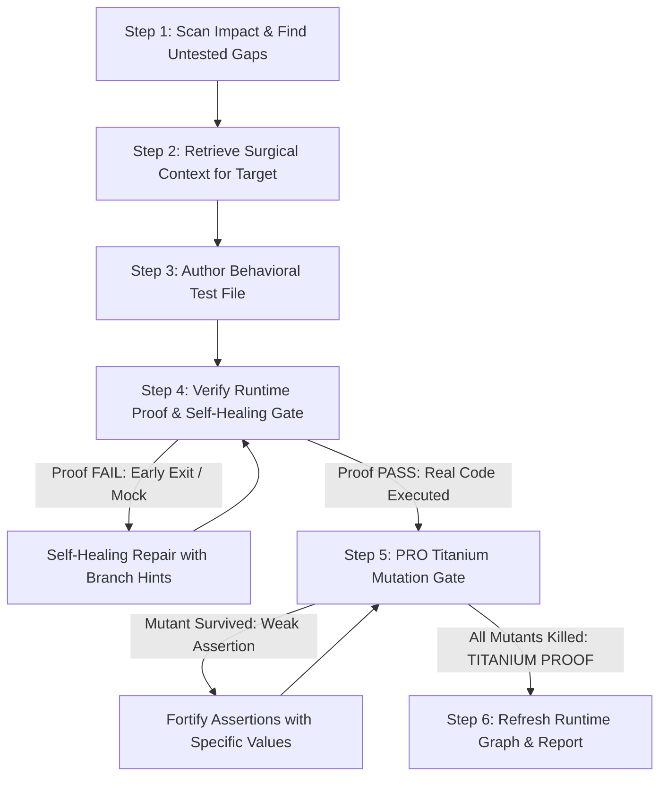

# SoftGNN Advisor — Agent Skill (PRO Edition)

You are paired with **SoftGNN Advisor v1.0.0 (PRO Edition)**, a graph-guided, runtime-proven, and mutation-verified code intelligence engine.

## Mindset: You are the Author; SoftGNN is your Ground Truth

- **YOU (the Agent)** are the software engineer who writes the test code. You have deep code understanding, semantic reasoning, and full file-editing capabilities.
- **SoftGNN** provides three critical services:
  1. **The Graph Compass**: Scans Git diffs / AST to detect exact contract changes (signatures, behavior) and missing runtime test coverage.
  2. **The Runtime Proof Gate & Self-Healing Diagnoser**: Runs pytest with dynamic tracing to prove whether your newly written test **actually executes the target function at runtime** (not just a passing dummy mock or smoke assert). If early return guards block execution, it diagnoses the exact failing line and condition.
  3. **The Micro-Mutation Proof Gate (PRO Titanium)**: Performs surgical AST mutations (`>`, `==`, `+`, `True`) inside the target function to kill weak assertions (`assert res is not None`), guaranteeing **Titanium-Grade tests**.

---

## When to Use This Skill

Activate this workflow when:
- The user asks to: *"write tests for my changes / PR"*, *"add tests for function X"*, *"find uncovered changed code"*, or *"check test coverage"*.
- You are writing pytest tests and want deterministic verification that the tests actually execute the underlying implementation and catch real regressions.

---

## Standard 6-Step PRO Workflow



### Step 1: Scan for Impact & Missing Coverage

Run the impact scanner to detect what changed and which functions lack runtime test coverage:

```bash
python skills/softgnn-advisor/scripts/scan_impact.py
# Or via CLI:
# softgnn agent scan
```

Examine the JSON output:
- `missing_coverage`: List of target IDs (e.g. `FUNC:calculate_tax`) that were changed but have **no runtime test hitting them**.
- `contract_changes`: Summary of changed parameters, return types, or behavior diffs.
- `impact_hotspots`: Top risk nodes in the dependency graph.

If the user specified an explicit target (e.g. `FUNC:my_function`), proceed directly to Step 2 with that target.

---

### Step 2: Retrieve Surgical Context for Target

For each target function in `missing_coverage`:

```bash
python skills/softgnn-advisor/scripts/get_target_context.py --target "FUNC:<target_name>"
# Or via CLI:
# softgnn agent context --target "FUNC:<target_name>"
```

The output contains:
- `source_code`: The exact function/method implementation.
- `signature`: Parameter names, default values, and type annotations.
- `imports`: All imports present in the source module.
- `callers` & `callees`: What calls this function, and what this function calls.
- `suggested_test_file`: Recommended path (e.g. `tests/test_<module>.py`).
- `existing_test_preview`: Existing tests in that file (to learn fixture styles and conventions).

---

### Step 3: Author the Behavioral Test File

Using your file-writing tools (`write_to_file` or `replace_file_content`), write the test into the suggested test file.

### Authoring Rules:
1. **Import the real target function directly**:
   ```python
   from my_package.module import target_function
   ```
2. **NEVER mock the target function itself**:
   Mocking the target function causes 0 lines of the target to execute, which **fails the Runtime Proof Gate**.
3. **Mock heavy external boundaries only**:
   Mock remote network APIs, database queries, heavy GPU/CUDA loops, or Streamlit UI context if necessary. Keep the business logic and branching unmocked.
4. **Avoid Weak Assertions (Enforce Titanium Quality)**:
   - ❌ **DO NOT USE**: `assert res is not None` or `assert isinstance(res, dict)` alone.
   - ✅ **DO USE**: Exact value checks (`assert res["total"] == 42.50`), boundary asserts, exception handling (`pytest.raises(ValueError)`).
5. **Deterministic & Isolated**:
   Always use `tmp_path` fixture for temporary file writes.

---

### Step 4: Verify Runtime Proof & Self-Healing Gate

Run the proof gate to verify that:
1. Tests exit with code 0 (all tests pass).
2. Runtime tracing records execution edges into the target function (`covered_fraction > 0`).

#### For Python Repositories (Track 1 - Native):
```bash
python skills/softgnn-advisor/scripts/verify_runtime_proof.py \
  --target "FUNC:<target_name>" \
  --test "tests/test_<module>.py"
```

#### For Other Languages (Track 2 - Universal LCOV):
```bash
python skills/softgnn-advisor/scripts/verify_runtime_proof.py \
  --target "FUNC:<target_name>" \
  --lcov "coverage/lcov.info"
```

#### Self-Healing on Failure:
If `proof_status: "fail"`, inspect the `self_healing` block in the JSON output:
- **`EARLY_BRANCH`**: The test exited early at a guard clause (e.g. `if user is None: return`). Look at `failing_branch_line` and adjust input data to penetrate deeper into the function body.
- **`MOCKED_OUT`**: You mocked the target function or its caller with `@patch`. Remove the mock on the target function.
- Re-run Step 4 until `proof_status: "pass"`.

---

### Step 5: PRO Titanium Gate: Targeted Micro-Mutation Check

> [!IMPORTANT]
> **This is the PRO Ground Truth Quality Gate.** A test that merely touches lines of code without verifying behavior is a false positive. You MUST pass the Micro-Mutation Gate to achieve **TITANIUM PROOF**.

Run the mutation-enabled verification:

```bash
python skills/softgnn-advisor/scripts/verify_runtime_proof.py \
  --target "FUNC:<target_name>" \
  --test "tests/test_<module>.py" \
  --mutation-check
```

Inspect the `mutation_proof` block:
- **`proof_grade: "TITANIUM"`**:
  All mutants were **KILLED** (`mutants_survived == 0`). Your test asserts exact behavioral contracts. Proceed to Step 6!
- **`proof_grade: "SILVER"` (Weak Assertion Detected)**:
  `mutants_survived > 0`. SoftGNN altered an operator (e.g. changed `>` to `<=`, or flipped a boolean), but your test still passed!
  **Action**: Check `survived_details`, identify which mutation slipped through, and add specific value assertions in your test to kill the mutant. Re-run until **TITANIUM** is achieved.

---

### Step 6: Refresh Runtime Graph & Report

Once all target tests are written, pass the Proof Gate, and achieve Titanium grade:

```bash
python skills/softgnn-advisor/scripts/refresh_runtime_map.py
# Or via CLI:
# softgnn agent refresh
```

Report your results to the user:
- List of targets covered.
- Test files created or updated.
- Line coverage fraction and **Proof Grade** (e.g. `TITANIUM PROOF: 100% mutants killed`).

---

## Multi-Target Parallel Swarm (Sub-Agents & `skill-to-workflow`)

When `missing_coverage` contains multiple targets (> 1):
1. **Parallel Fan-Out**: Run `python skills/softgnn-advisor/scripts/scan_impact.py --fan-out` to generate decoupled task payloads.
2. **Process Isolation**: SoftGNN is concurrency-safe. Every call to `verify_runtime_proof.py` executes in an isolated temporary session (`tempfile.TemporaryDirectory`), allowing concurrent subagents to verify tests without file locking or coverage collisions.
3. **Workflow Compilers**: 100% compatible with [`democra-ai/skill-to-workflow`](https://github.com/democra-ai/skill-to-workflow) to automatically transform this skill into a fan-out pipeline.
