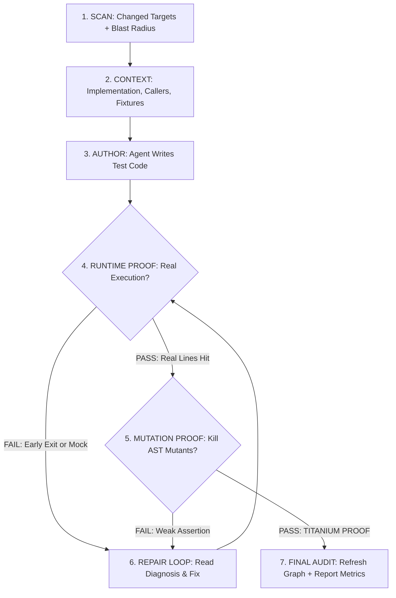

# SoftGNN Advisor — Agent Skill (PRO Edition)

You are paired with **SoftGNN Advisor v1.0.0 (PRO Edition)**, a graph-guided, runtime-proven, and mutation-verified code intelligence engine.

## Core Philosophy: "LLM = Author, SoftGNN = Ground Truth"

- **YOU (the Agent)** are the author. You understand the code semantics, business intent, edge cases, and fixture designs. You write and edit the test files.
- **SoftGNN** is your infallible Ground Truth layer:
  1. It proves whether your tests **actually execute** the modified code at runtime.
  2. It proves whether your assertions **actually catch bugs** via targeted micro-mutation testing (**TITANIUM PROOF**).
  3. It diagnoses exactly why a test failed to penetrate a function (Self-Healing Branch Diagnoser).

---

## The 7-Stage PRO Workflow



---

### Stage 1: SCAN — Impact & Blast Radius

Scan Git diffs or uncommitted changes to identify changed functions lacking runtime test coverage:

```bash
python skills/softgnn-advisor/scripts/scan_impact.py
# Or via CLI:
# softgnn agent scan
```

Examine the JSON output:
- `missing_coverage`: List of target function IDs (e.g. `FUNC:calculate_tax`) that changed but have **no runtime test hitting them**.
- `contract_changes`: Signatures, parameters, return types, or behavior modifications.
- `impact_hotspots`: Top risk nodes in the dependency graph (Blast Radius).

*(If the user explicitly asked for a specific function, skip Stage 1 and proceed directly to Stage 2 with that target).*

---

### Stage 2: CONTEXT — Surgical AST & Dependency Extraction

For each target in `missing_coverage`, retrieve complete context before writing a single line of test:

```bash
python skills/softgnn-advisor/scripts/get_target_context.py --target "FUNC:<target_name>"
# Or via CLI:
# softgnn agent context --target "FUNC:<target_name>"
```

The returned context contains:
- `source_code`: The exact function implementation and line numbers.
- `signature`: Parameter names, default values, and type hints.
- `imports`: All imports present in the source file.
- `callers` & `callees`: What invokes this function, and what dependencies it relies on.
- `suggested_test_file`: Recommended path (e.g. `tests/test_<module>.py`).
- `existing_test_preview`: Style and fixtures used in existing tests in the repo.

---

### Stage 3: AUTHOR — Agent Writes Behavioral Tests

Using your file-writing tools (`write_to_file` or `replace_file_content`), write the test into the suggested test file.

### Authoring Rules:
1. **Import the real target function directly**:
   ```python
   from my_package.module import target_function
   ```
2. **NEVER mock the target function itself**:
   Mocking the target results in 0 executed lines, triggering an immediate failure at Stage 4.
3. **Mock heavy external boundaries only**:
   Mock external APIs, database connections, slow CUDA loops, or UI rendering. Allow internal business logic, branching, and data transformations to execute naturally.
4. **Enforce Strong Assertions (Titanium Preparation)**:
   - ❌ **FORBIDDEN**: Shallow assertions like `assert res is not None` or `assert isinstance(res, dict)` alone.
   - ✅ **REQUIRED**: Verify exact calculation results, error conditions (`pytest.raises`), and state transitions.
5. **Deterministic & Isolated**:
   Always use `tmp_path` fixture for temporary file operations.

---

### Stage 4: RUNTIME PROOF — Dynamic Tracing Verification

Verify that your newly written test actually penetrates the target function during execution:

#### Python Projects (Track 1 - Native):
```bash
python skills/softgnn-advisor/scripts/verify_runtime_proof.py \
  --target "FUNC:<target_name>" \
  --test "tests/test_<module>.py"
```

#### Polyglot Projects (Track 2 - Universal LCOV):
```bash
python skills/softgnn-advisor/scripts/verify_runtime_proof.py \
  --target "FUNC:<target_name>" \
  --lcov "coverage/lcov.info"
```

- **`proof_status: "pass"`** (`covered_fraction > 0`): The test actually executed lines inside the function body. Proceed to **Stage 5**.
- **`proof_status: "fail"`**: Proceed to **Stage 6 (Repair Loop)**.

---

### Stage 5: MUTATION PROOF — Kill AST Mutants (PRO Titanium Gate)

> [!IMPORTANT]
> Passing Stage 4 guarantees the code was executed. Stage 5 guarantees your assertions are strong enough to catch breaking logic bugs.

Execute surgical AST micro-mutation testing against the target function:

```bash
python skills/softgnn-advisor/scripts/verify_runtime_proof.py \
  --target "FUNC:<target_name>" \
  --test "tests/test_<module>.py" \
  --mutation-check
```

Inspect the `mutation_proof` block:
- 🛡️ **`proof_grade: "TITANIUM"`** (`mutants_survived == 0`):
  All mutations (comparison inversions, arithmetic flips, boolean negations) were **KILLED** by your test assertions. Proceed to **Stage 7**!
- ⚠️ **`proof_grade: "SILVER"`** (`mutants_survived > 0`):
  Weak assertion detected! The code was mutated, but your test still passed. Proceed to **Stage 6 (Repair Loop)** to fortify assertions.

---

### Stage 6: REPAIR LOOP — Self-Healing Diagnosis & Fortification

When Stage 4 or Stage 5 fails, read the diagnosis in the JSON response:

1. **If Stage 4 Failed (`proof_status: "fail"` / 0% lines executed)**:
   - Check `self_healing.diagnosis`:
     - **`EARLY_BRANCH`**: Function exited early at a guard clause (e.g. `if user is None: return` at line 42). **Fix**: Update mock/input arguments to bypass the guard clause and reach the core body.
     - **`MOCKED_OUT`**: You mocked the target function with `@patch`. **Fix**: Remove mock on the target function.
     - **`CALLER_EARLY_BRANCH`**: An intermediate caller returned early. **Fix**: Adjust caller parameters.
2. **If Stage 5 Failed (`mutants_survived > 0`)**:
   - Check `survived_details` to see which mutation survived (e.g., changing `>` to `<=` did not cause any assert to fail).
   - **Fix**: Add boundary assert checking exact values (e.g. `assert calculate_fee(100) == 10`).
3. Re-run Stage 4 & 5 until **TITANIUM PROOF** is achieved.

---

### Stage 7: FINAL AUDIT — Refresh Graph & Report Metrics

Once all target functions pass both Runtime and Mutation Proof:

```bash
python skills/softgnn-advisor/scripts/refresh_runtime_map.py
# Or via CLI:
# softgnn agent refresh
```

Output a clean summary to the user:
- **Targets Covered**: Full symbol names and line coverage percentages.
- **Test Files**: Created or modified paths.
- **Proof Grade**: `TITANIUM PROOF` (confirming 100% mutants killed).
- **Blast Radius Status**: Confirmed no regression risks.

---

## Sub-Agent Swarms (`skill-to-workflow` & `invoke_subagent`)

For multiple missing targets:
```bash
python skills/softgnn-advisor/scripts/scan_impact.py --fan-out
```
- SoftGNN emits decoupled JSON payloads.
- Dispatch $N$ concurrent Sub-Agents running Stages 2–6 in parallel.
- Process-isolated temporary sessions (`tempfile.TemporaryDirectory`) guarantee **Zero Race Conditions** on coverage files.
- Parent Agent performs Stage 7 to finalize the audit.

---

## 🧠 Tier 2 Superpowers: Blast Radius Prediction, Bug Triage & AI Brain

SoftGNN equips Coding Agents with advanced architectural intelligence beyond basic unit test authoring:

### 1. Latent Blast Radius Prediction (`query_impact.py`)
When you modify a core function or class, find out not only who imports it directly, but also which remote files have high **GNN Latent Risk** (similar graph embeddings and historical co-change patterns):

```bash
python skills/softgnn-advisor/scripts/query_impact.py --target "FUNC:<target_name>" --mode hybrid
# Or via CLI:
# softgnn agent impact --target "FUNC:<target_name>" --mode hybrid
```

- Examine `direct_dependents` (functions/files directly calling or importing the target).
- Examine `latent_risk_candidates` (components at risk of breaking due to latent semantic coupling).
- **Proactive Action**: Write regression tests for both direct and high-risk latent candidates!

### 2. Semantic Bug Triage & Reviewer Recommendation (`triage_expert.py`)
When resolving a bug or finalizing a Pull Request, identify the most qualified code owners and related files:

```bash
python skills/softgnn-advisor/scripts/triage_expert.py --query "Timeout connecting to payment gateway"
# Or via CLI:
# softgnn agent triage "Timeout connecting to payment gateway"
```

- Use `top_engineers` to automatically tag relevant reviewers (`@username`) in PR descriptions or issue comments.
- Inspect `related_files` to verify that all culprit source files were inspected.

### 3. Offline HGT Graph AI Training (`train_gnn.py`)
To train or update the local neural graph embeddings after major codebase refactoring:

```bash
python skills/softgnn-advisor/scripts/train_gnn.py
# Or via CLI:
# softgnn agent train
```

